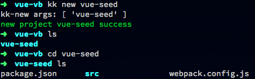
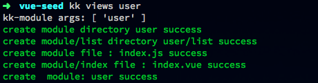

###poke-ball
	node 命令行工具, 可以帮助你快速创建一个vuejs seed,并提供一些脚手架功能

#####Installation
	npm install poke-ball -g

#####Feature
- kk -h
- kk new projectName (create project)
- kk views viewsName (add module/views)
- kk views viewsName/subViewsName (add subModule/subViews)

##### tips
 - <>:必填参数，［］可选参数
 - 创建views,subviews,directive...时，请确保在vuejs 项目目录下
 - views 相当于module
 - 创建subviews时，views必须要存在

#####Example
 - npm全局安装 poke-ball
 - 
 - 进入工作目录，新建seed project
 - 
 - 进入seed，新建模块：kk views viewsName
 - 
 - 新建子模块： kk views viewsName/subViewsName
 - 
 - 安装依赖 sudo npm i(有些模块需要较高的权限)
 - 
 - 运行项目 npm start
 - 
